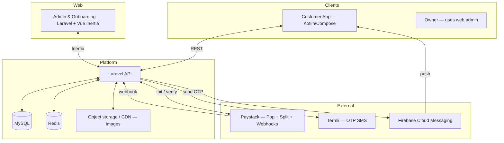
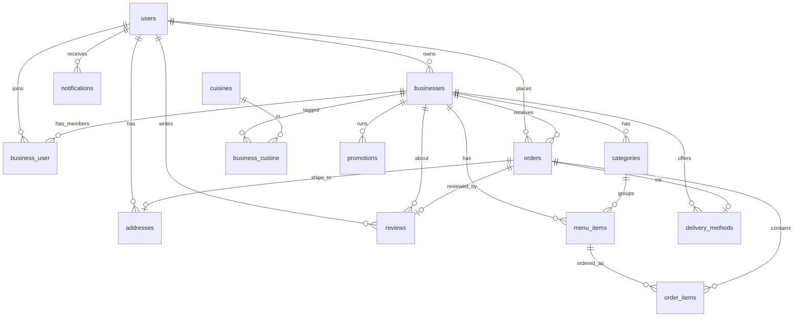
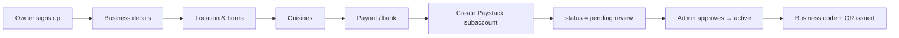
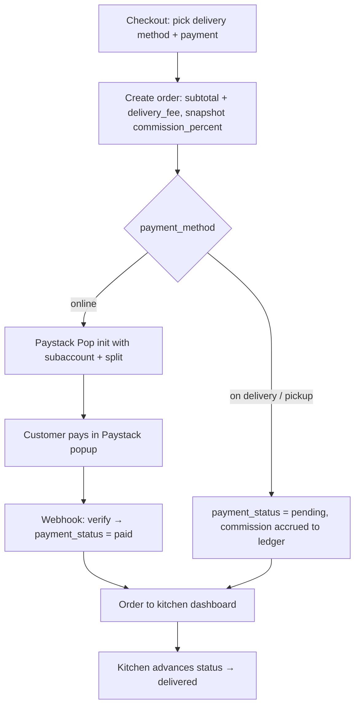

# Klinqo — Architecture v2

**Tagline:** "Savor every bite"
**Updated to match:** the interactive prototype + 6 product decisions (Jun 2026)

This supersedes the earlier MVP architecture. It reflects the new positioning (a kitchen-discovery platform, not an isolated white-label storefront), a per-order percentage commission, in-app reviews, business self-onboarding, configurable fees, Termii OTP, and Paystack Pop.

---

## 1. What changed from v1

| Area | v1 (original) | v2 (now) |
|---|---|---|
| Positioning | Isolated white-label; QR is the only entry | Discovery platform — browse/search kitchens by cuisine, join many; QR still works |
| Revenue | Flat per-order fee (TBD) | **Per-order % commission** taken via Paystack split |
| Reviews | Not in scope | **In v1** — verified, order-based |
| Business onboarding | Manual | **Self-serve in v1** (owner → details → location → payout → live) |
| Fees | Hardcoded ₦800 delivery + ₦200 service | **Removed** — delivery fee comes from configurable per-kitchen delivery methods |
| OTP | TBD | **Termii** |
| Payments | Custom card form (mock) | **Paystack Pop** (inline) + subaccounts/split + webhook verify |

A note on the positioning change: customers can now discover kitchens, so two "businesses" relationships exist — the **owner** of a kitchen, and the **customers who have joined** a kitchen. Both are modeled below.

---

## 2. System architecture

---

## 3. Revenue model — per-order % commission

The cleanest production pattern with Paystack is **subaccounts + split payments**:

1. During onboarding, each kitchen connects their bank details → we create a **Paystack subaccount** for them and store `paystack_subaccount_code`.
2. At checkout (online payment), the transaction is initialized with the kitchen's subaccount and a **split**: the platform keeps `commission_percent`, the rest settles to the kitchen automatically.
3. For pay-on-delivery / pay-on-pickup orders (no online payment), commission is **accrued** as a ledger entry and settled periodically (or netted against the kitchen's online payouts).

So commission is *not* a customer-facing line item. The customer pays `subtotal + delivery_fee`. The platform's cut comes out of the kitchen's share. Each order snapshots `commission_percent` and stores the computed `commission_amount` so historical orders stay accurate even if the rate changes later.

`platform_settings.default_commission_percent` sets the default; `businesses.commission_percent` can override per kitchen.

---

## 4. Database schema

### users
| Column | Type | Notes |
|---|---|---|
| id | UUID | PK |
| name | varchar | |
| phone | varchar | unique, login identity |
| email | varchar | nullable |
| password | varchar | hashed |
| avatar_url | varchar | nullable |
| role | enum | `customer`, `business_owner`, `admin` |
| is_verified | bool | phone verified via OTP |
| timestamps | | |

### businesses (a "kitchen")
| Column | Type | Notes |
|---|---|---|
| id | UUID | PK |
| owner_user_id | UUID FK→users | the owner |
| name | varchar | |
| slug | varchar | unique |
| business_code | varchar(10) | for QR / manual join (e.g. `MIRAS01`) |
| tagline | varchar | |
| description | text | |
| logo_url / cover_image_url | varchar | |
| phone / email | varchar | |
| address | text | |
| area | varchar | e.g. "Ikoyi, Lagos" — shown in discovery |
| latitude / longitude | decimal | for distance in discovery |
| prep_time_min / prep_time_max | int | minutes |
| rating | decimal(2,1) | cached avg (denormalized) |
| review_count | int | cached |
| status | enum | `pending`, `active`, `suspended` |
| commission_percent | decimal(5,2) | overrides platform default |
| operating_hours | json | per-day open/close |
| accepts_online / accepts_on_delivery / accepts_on_pickup | bool | payment toggles (replaces hardcoded payment_methods) |
| bank_name / bank_account_number / bank_account_name | varchar | payout |
| paystack_subaccount_code | varchar | for split payments |
| onboarding_step | varchar | resume self-onboarding |
| onboarded_at | timestamp | nullable |
| timestamps | | |

### cuisines  /  business_cuisine
`cuisines`: id, name, emoji, slug. (Nigerian, Continental, Asian, Fast food, Coffee, Healthy, Grill, Drinks, Bakery, …)
`business_cuisine` (pivot): business_id, cuisine_id. Powers "browse by cuisine" and cross-kitchen search.

### business_user (customer ↔ kitchen membership)
| Column | Type | Notes |
|---|---|---|
| id | UUID | PK |
| business_id | UUID FK | |
| user_id | UUID FK | |
| joined_at | timestamp | via QR, code, or discovery |
| (unique) | | (business_id, user_id) |

### categories
id, business_id FK, name, emoji, image_url (nullable), sort_order, is_active, timestamps.

### menu_items
| Column | Type | Notes |
|---|---|---|
| id | UUID | PK |
| business_id | UUID FK | |
| category_id | UUID FK | |
| name | varchar | |
| description | text | |
| price | decimal(10,2) | |
| image_url | varchar | |
| prep_minutes | int | |
| is_available | bool | toggle |
| is_popular | bool | "Popular this week" |
| sort_order | int | |
| timestamps | | |

### addresses
id, user_id FK, label, address_line, landmark (nullable), phone, latitude/longitude (nullable), is_default bool, timestamps.

### delivery_methods (configurable — no hardcoded fee)
id, business_id FK, name (e.g. "Standard delivery", "Pickup"), description, fee decimal(10,2), is_active, sort_order.

### orders
| Column | Type | Notes |
|---|---|---|
| id | UUID | PK |
| order_number | varchar | human ref e.g. `KLQ-0042` |
| business_id | UUID FK | |
| user_id | UUID FK | |
| delivery_type | enum | `delivery`, `pickup` |
| delivery_method_id | UUID FK | nullable (pickup) |
| address_id | UUID FK | nullable (pickup) |
| payment_method | enum | `online`, `pay_on_delivery`, `pay_on_pickup` |
| payment_status | enum | `pending`, `paid`, `failed`, `refunded` |
| payment_reference | varchar | Paystack ref |
| status | enum | `placed`, `confirmed`, `preparing`, `ready`, `delivering`, `delivered`, `cancelled` |
| subtotal | decimal(10,2) | |
| delivery_fee | decimal(10,2) | from chosen delivery_method |
| total | decimal(10,2) | what the customer pays (subtotal + delivery_fee) |
| commission_percent | decimal(5,2) | snapshot at order time |
| commission_amount | decimal(10,2) | computed platform cut |
| note | text | nullable |
| placed_at | timestamp | |
| timestamps | | |

### order_items (snapshot pricing)
id, order_id FK, menu_item_id FK (nullable if item later deleted), name (snapshot), unit_price (snapshot), quantity, total_price, note (nullable).

### reviews (verified, order-based — v1)
| Column | Type | Notes |
|---|---|---|
| id | UUID | PK |
| order_id | UUID FK | unique — one review per order |
| business_id | UUID FK | denormalized for fast kitchen queries |
| user_id | UUID FK | |
| rating | tinyint | 1–5 |
| text | text | nullable |
| created_at | timestamp | |

Writing a review recomputes `businesses.rating` / `review_count`.

### notifications
id, user_id FK, type enum(`order`,`promo`,`general`), title, body, data json (deep-link payload), read_at (nullable), created_at.

### promotions (light — banners + codes seen in prototype)
id, business_id FK (nullable = platform-wide), code (nullable), title, subtitle, type enum(`free_delivery`,`percent_off`,`flat_off`), value, starts_at, ends_at, is_active.

### platform_settings (single row / config)
default_commission_percent, support_phone, support_email, etc.

---

## 5. Key flows

### Business self-onboarding

For Mira specifically you can fast-track: create her record, approve, done. The flow exists for the next kitchens.

### Order + commission (online payment)

### Customer discovery / onboarding
QR scan or code → join kitchen → its menu. **Or** browse home/search → pick a cuisine → see kitchens → open one → join. One account spans every kitchen joined; switch via the business switcher.

---

## 6. Tech stack

| Layer | Choice |
|---|---|
| Customer app | Kotlin, Jetpack Compose, Retrofit, Hilt, Room |
| Admin + onboarding (web) | Laravel 12, Vue 3, Inertia, Tailwind |
| API | Laravel 12, Sanctum |
| DB / cache | MySQL 8 / Redis |
| Payments | **Paystack Pop** (inline) + subaccounts + split + webhooks |
| OTP | **Termii** |
| Push | Firebase Cloud Messaging |
| Images | Object storage + CDN (uploads replace Unsplash placeholders) |

Payment safety: card data never touches our servers — Paystack Pop handles entry; we only init server-side and confirm via webhook + verify call. No custom card form.

---

## 7. Build order (thin vertical slice first)

1. Migrations + models for the schema above; seed cuisines + Mira's kitchen, categories, menu.
2. Auth: phone + Termii OTP, Sanctum tokens, register/login.
3. Customer: discovery (cuisines + kitchen list/search), join kitchen, menu browse, item detail, cart.
4. Checkout: delivery method selection, Paystack Pop online + pay-on-delivery/pickup, order creation with commission snapshot, webhook verify.
5. Admin (web): incoming orders + status updates, menu CRUD, delivery methods, business settings.
6. Reviews, notifications (FCM), business self-onboarding + Paystack subaccount creation.
7. Promotions (codes/banners) last.

---

## 8. Still open (not blockers)
- Pay-on-delivery/pickup commission settlement cadence (per-week netting vs invoice).
- Whether discovery is location-gated (only kitchens that deliver to the customer's area) at launch or later.
- Image moderation / review moderation policy as volume grows.
